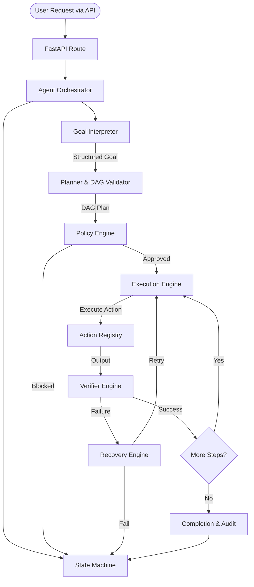

# LinuxPilot Agent Core Architecture

This document outlines the Phase 2 Agent Core Engine architecture for LinuxPilot. It establishes a highly decoupled, state-driven workflow for evaluating and executing tasks safely.

## Core Abstractions

The system is separated into discrete, testable abstractions:

### 1. State Machine (`state_machine.py`)
Provides deterministic and validated state transitions (e.g., `IDLE` -> `UNDERSTANDING` -> `PLANNING` -> `POLICY_CHECK` -> `READY` -> `EXECUTING` -> `VERIFYING`). State transitions are not loosely defined strings, they are strictly enforced enums with transition graphs.

### 2. Goal Interpreter (`goal_understanding.py`)
Converts raw natural language queries into a structured `GoalUnderstanding` model representing the objective, constraints, entities, and operations.

### 3. Planner (`planner.py`)
Translates a Goal into an `ExecutionPlan`. The plan consists of multiple `PlanStep`s linked together in a Directed Acyclic Graph (DAG). The planner utilizes Kahn's algorithm for dependency topological sorting and cycle detection.

### 4. Action Registry (`actions/registry.py`)
A universal catalog of all capabilities. Defines standard `ActionDefinition` signatures for OS handlers (filesystem, browser, etc.) and explicitly prevents unregistered or unknown capabilities from executing.

### 5. Policy Engine (`policy.py`)
Classifies the risk level of requested actions (Levels 0 through 5). Acts as a gatekeeper, deciding if actions can be allowed, blocked, or require user approval / snapshots.

### 6. Execution Engine (`executor.py`)
Synchronously dispatches the action definitions to the matching handler inside the `ActionRegistry`. Records outputs and error states without assuming success.

### 7. Verifier (`verifier.py`)
Evaluates the outputs of an execution against the expected state, producing structured verification results and failure evidence if an operation failed to perform its side effects.

### 8. Recovery Engine (`recovery.py`)
Determines whether a failed action should be retried (subject to limits), replanned, rolled back, or failed permanently based on execution state and verification results.

## Execution Flow

## Independence

The `apps/api/app/agent/` directory is strictly isolated from FastAPI HTTP requests and responses. The orchestrator interacts through callbacks, allowing the entire core engine to be portable to long-running daemons or separate worker processes in future phases.
